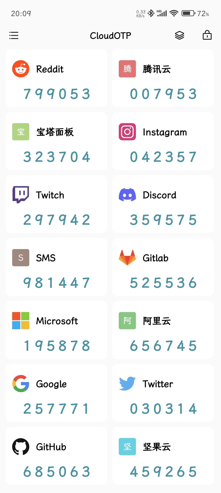
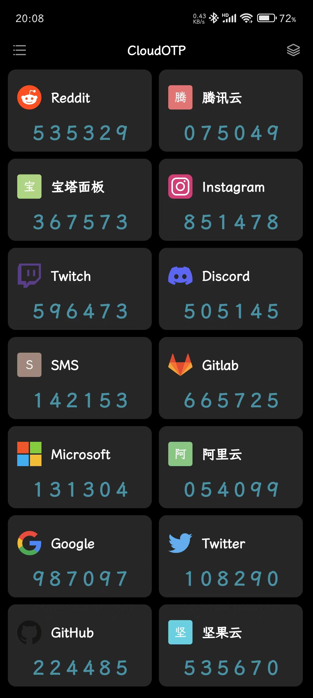
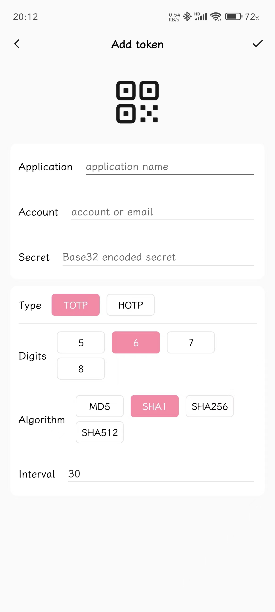
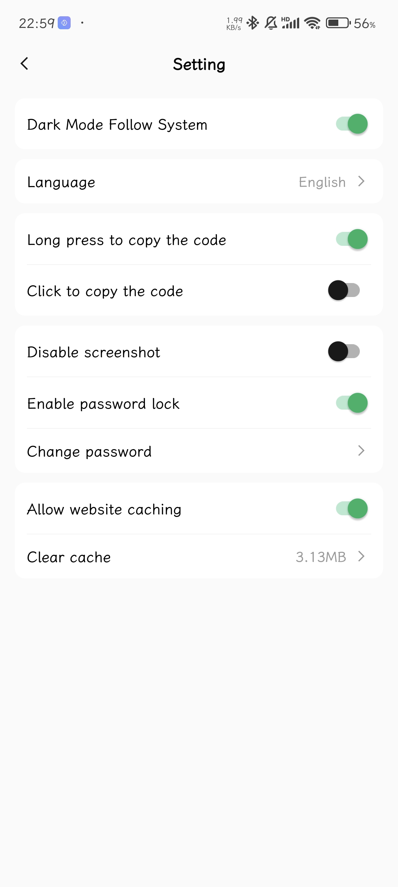
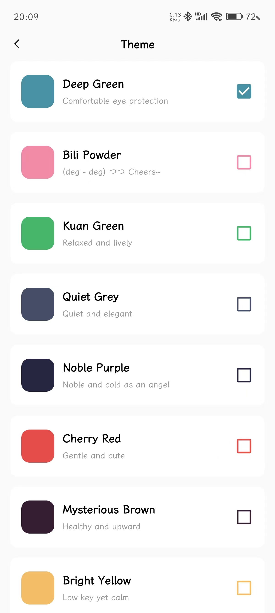

## Introduction

This is a awesome two-factor authenticator for Android which supports dropbox.

The algorithm part comes from https://github.com/freeotp/freeotp-android.

## Highlights

- Support TOTP and HOTP
- Support manual filling and QR code scanning to add tokens
- Support import/export of JSON/URI file
- Support import/export of encrypted files (using standard AES-256 algorithm)
- Support backing up encrypted files to Dropbox
- Support password lock and biometric identification
- Support dark mode and switching theme colors
- Support multiple languages: English, Simplified Chinese, Traditional Chinese, Japanese

## Screenshots

## TODO

- [ ] Support Google Drive
- [ ] Support WebDAV services such as Box
- [ ] Support more encryption algorithms
- [ ] Support encrypting local SQLite database