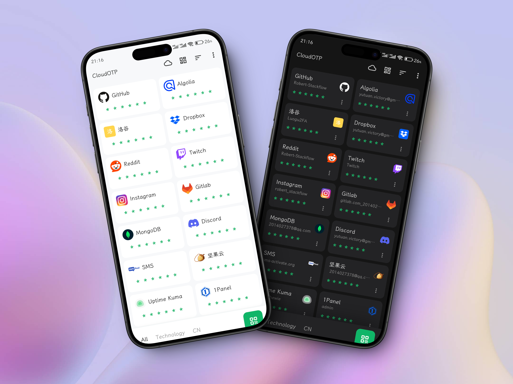
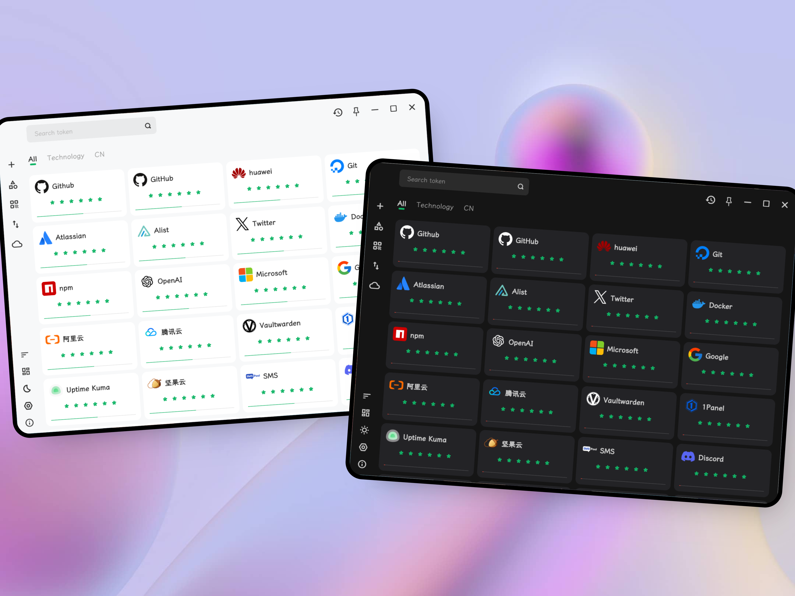
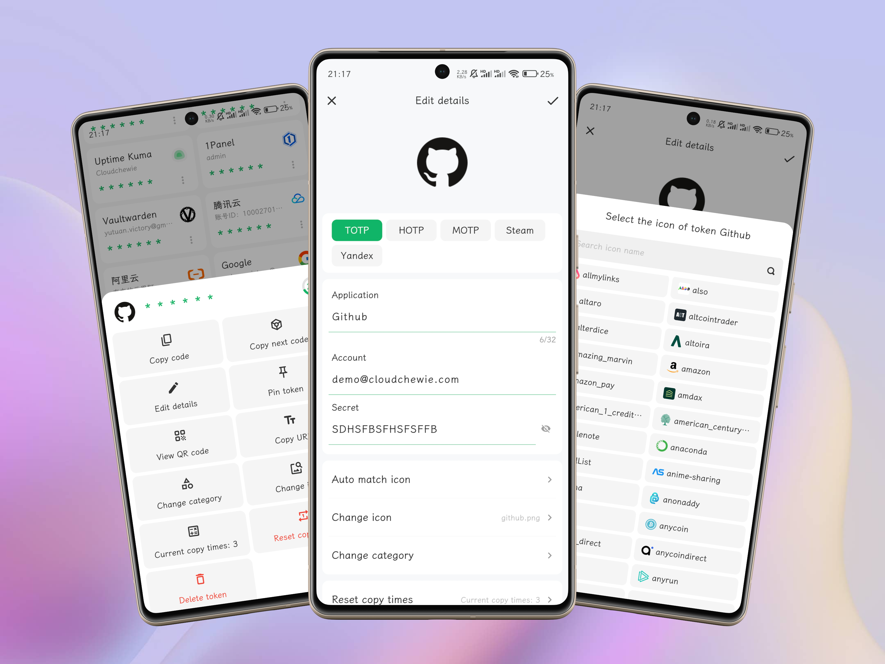
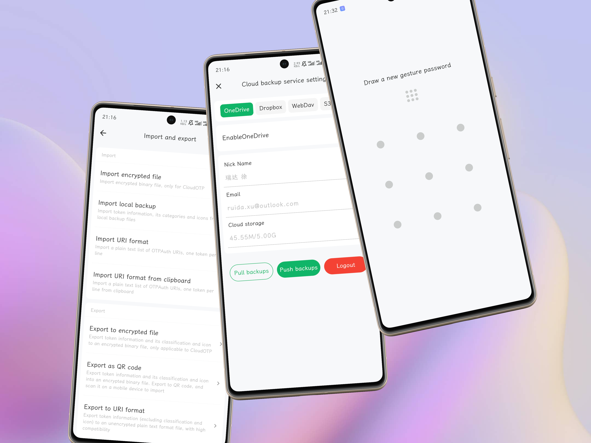
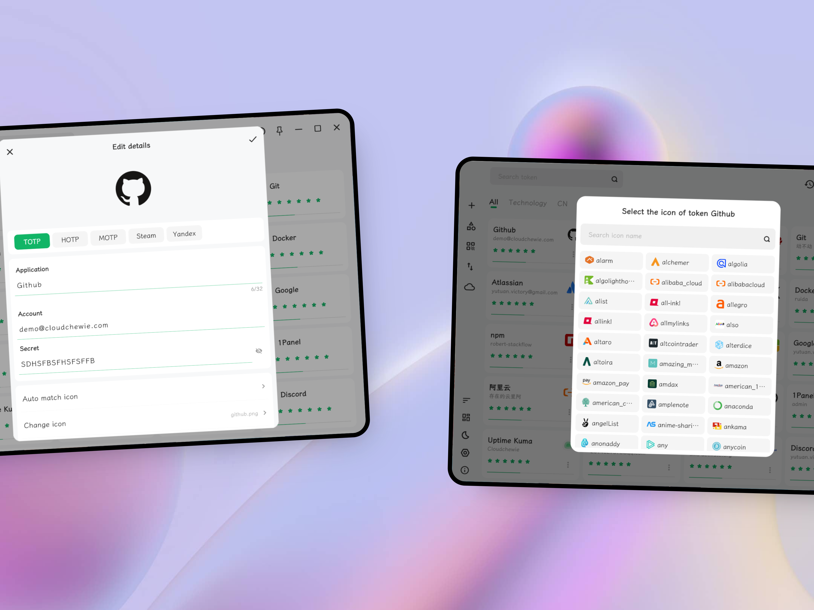

## Introduction

This is an awesome two-factor authenticator based on Flutter for Android and Windows which supports cloud backup.

## Highlights

- Reconstructed based on Flutter architecture, supports Android and Windows
- Support TOTP, HOTP, MOTP, Steam, Yandex
- Supports scanning QR code to add, identify pictures, and manually enter keys
- Supports custom icons and categories, supports sorting and multiple token layouts
- Supports dark mode, multiple languages, and multiple themes
- Supports local backup and automatic backup, supports WebDav, Onedrive, Dropbox, S3 storage and other cloud backup methods
- Supports import/export of encrypted files and URI lists
- Supports database encryption and gesture password

## Screenshots

